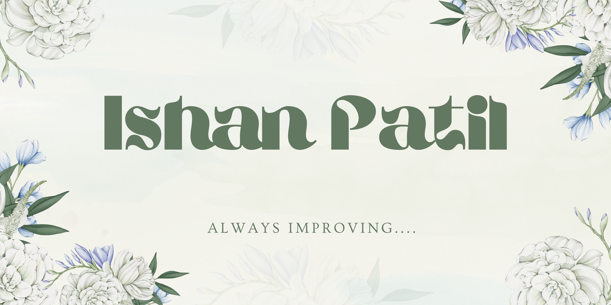

 
# Hi there, I'm Ishan 👋

### Software Developer • Backend & Systems Enthusiast

 

## 👨‍💻 About Me

Hey! I'm Ishan, a software developer who loves building things that work well and look clean. I'm all about writing code that's easy to read and maintain because future-me (and anyone else) will appreciate it.

- 🔥 I enjoy building **reliable and efficient software**
- 🌱 Currently learning **Python, Java, and Rust**
- 💡 Interested in **backend systems and scalable architectures**
- 🎯 Always aiming for **simple, clean, and maintainable code**
- 📫 Reach me at: **ishanpatil2005@gmail.com**

 

 

## 🛠️ Tech Stack

 

## 📊 GitHub Stats

  

 

## 💬 Let's Connect

  
  &nbsp;&nbsp;&nbsp;
  

 

*"Readable code > clever code"*

Thanks for visiting! 😊

